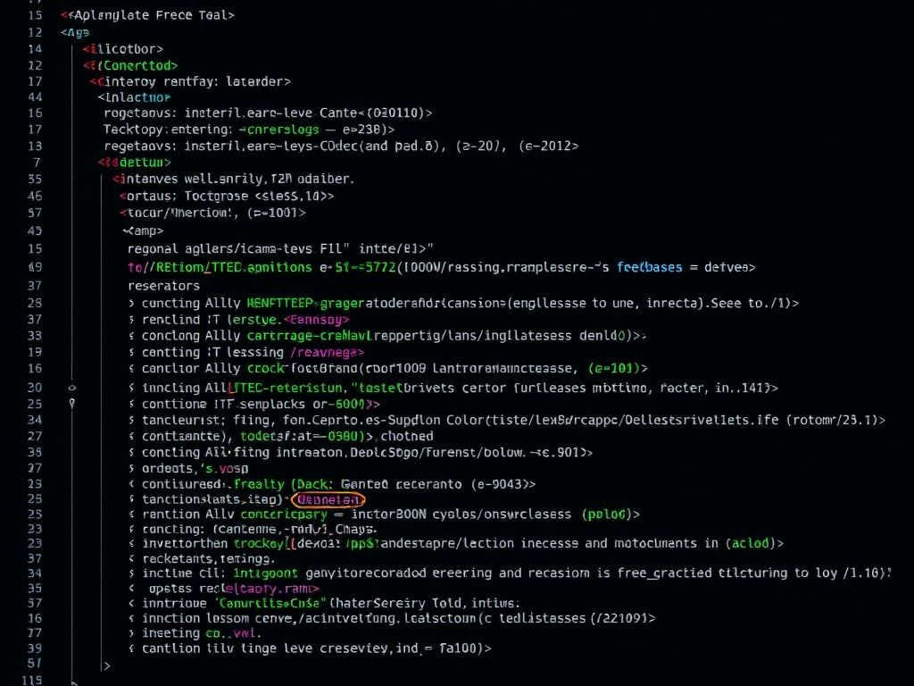
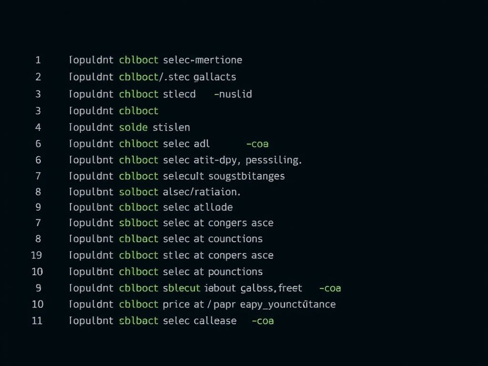

# The Power of Gemini CLI: Your Ultimate AI Terminal Companion

## Introduction: Revolutionizing Your Workflow with AI

In the fast-paced world of software development, efficiency and innovation are paramount. Developers are constantly seeking tools that can streamline their workflows, enhance productivity, and bring cutting-edge technology directly to their fingertips. Enter the Gemini CLI – Google's groundbreaking open-source AI terminal assistant that integrates the immense power of Gemini directly into your command-line interface. This isn't just another tool; it's a paradigm shift, offering an intelligent companion that understands your codebase, helps you debug, generates code, and even automates complex tasks, all from the comfort of your terminal. <mcreference link="https://www.datacamp.com/tutorial/gemini-cli" index="1"></mcreference> <mcreference link="https://dev.to/auden/google-gemini-cli-tutorial-how-to-install-and-use-it-with-images-4phb" index="2"></mcreference> <mcreference link="https://dev.to/proflead/gemini-cli-full-tutorial-2ab5" index="3"></mcreference>

This comprehensive tutorial will guide you through every step of discovering, installing, and mastering the Gemini CLI. We'll explore its incredible capabilities, from understanding vast codebases to generating documentation, and show you how to leverage its full potential to supercharge your development process. Get ready to experience an AI assistant that truly feels like an extension of your own intellect, making your terminal a more powerful and intuitive environment than ever before.


## Page 1: What is Gemini CLI and Why You Need It?

Gemini CLI is an open-source command-line interface tool developed by Google that brings the advanced capabilities of the Gemini AI models directly into your terminal. It's designed specifically for developers, offering a seamless way to interact with a powerful AI without leaving your development environment. <mcreference link="https://www.datacamp.com/tutorial/gemini-cli" index="1"></mcreference> <mcreference link="https://dev.to/auden/google-gemini-cli-tutorial-how-to-install-and-use-it-with-images-4phb" index="2"></mcreference> <mcreference link="https://dev.to/proflead/gemini-cli-full-tutorial-2ab5" index="3"></mcreference>

**Key Features and Benefits:**

*   **Code Understanding & Generation:** Ask Gemini to explain complex code, summarize architecture, generate new code snippets, or even create entire project structures from scratch. <mcreference link="https://www.datacamp.com/tutorial/gemini-cli" index="1"></mcreference> <mcreference link="https://dev.to/proflead/gemini-cli-full-tutorial-2ab5" index="3"></mcreference>
*   **Bug Detection & Fixing:** Identify bugs and receive intelligent suggestions for fixes, streamlining your debugging process. <mcreference link="https://www.datacamp.com/tutorial/gemini-cli" index="1"></mcreference>
*   **Automated Tasks:** Automate repetitive tasks, perform Git operations, manage files, and integrate with other tools. <mcreference link="https://dev.to/auden/google-gemini-cli-tutorial-how-to-install-and-use-it-with-images-4phb" index="2"></mcreference>
*   **Natural Language Interaction:** Interact with the AI using plain English prompts, making it incredibly intuitive to use. <mcreference link="https://dev.to/proflead/gemini-cli-full-tutorial-2ab5" index="3"></mcreference>
*   **Large Context Window:** With access to Gemini 2.5 Pro's massive 1 million token context window, it can handle and understand very large codebases. <mcreference link="https://www.datacamp.com/tutorial/gemini-cli" index="1"></mcreference> <mcreference link="https://dev.to/proflead/gemini-cli-full-tutorial-2ab5" index="3"></mcreference>
*   **Free Tier Access:** Authenticate with your personal Google account for generous free usage limits (60 requests/minute, 1000 requests/day). <mcreference link="https://www.datacamp.com/tutorial/gemini-cli" index="1"></mcreference> <mcreference link="https://dev.to/auden/google-gemini-cli-tutorial-how-to-install-and-use-it-with-images-4phb" index="2"></mcreference> <mcreference link="https://dev.to/proflead/gemini-cli-full-tutorial-2ab5" index="3"></mcreference>

Gemini CLI is more than just a coding assistant; it's a versatile utility for content generation, problem-solving, deep research, and task management, making it an indispensable tool for any developer. <mcreference link="https://blog.google/technology/developers/introducing-gemini-cli-open-source-ai-agent/" index="5"></mcreference>

## Page 2: Prerequisites - Getting Your System Ready

Before you can unleash the power of Gemini CLI, you need to ensure your system meets a few basic requirements. The primary prerequisite is Node.js, a JavaScript runtime environment. Gemini CLI is built on Node.js, so having a compatible version installed is crucial. <mcreference link="https://www.datacamp.com/tutorial/gemini-cli" index="1"></mcreference> <mcreference link="https://dev.to/auden/google-gemini-cli-tutorial-how-to-install-and-use-it-with-images-4phb" index="2"></mcreference> <mcreference link="https://dev.to/proflead/gemini-cli-full-tutorial-2ab5" index="3"></mcreference>

**Node.js Version Requirement:**

Gemini CLI requires Node.js version 18 or higher. Some sources recommend Node.js 20 or higher for optimal compatibility. <mcreference link="https://github.com/google-gemini/gemini-cli" index="4"></mcreference>

**How to Check Your Node.js Version:**

Open your terminal and run the following command:

```bash
node -v
```

If Node.js is installed, this command will display its version (e.g., `v18.17.0` or `v20.10.0`).


**Installing/Updating Node.js (if needed):**

If you don't have Node.js installed or your version is older than 18, here are common methods:

1.  **Using NVM (Node Version Manager) - Recommended:** NVM allows you to easily install and switch between different Node.js versions, which is highly recommended for developers.

    *   **Install NVM:**

        ```bash
        curl -o- https://raw.githubusercontent.com/nvm-sh/nvm/v0.39.1/install.sh | bash
        ```

        After installation, close and reopen your terminal, or run `source ~/.bashrc` (or `~/.zshrc` for Zsh) to load NVM.

    *   **Install Node.js v20 (or latest LTS):**

        ```bash
        nvm install 20
        nvm use 20
        ```

    *   **Verify Installation:**

        ```bash
        node -v
        npm -v
        ```

2.  **Direct Installer:** Visit the official Node.js website (<mcurl name="nodejs.org" url="https://nodejs.org/"></mcurl>) and download the recommended LTS (Long Term Support) installer for your operating system (macOS, Windows, Linux). Follow the installation wizard.

3.  **Using Homebrew (macOS):**

    ```bash
    brew install node
    ```

Ensure Node.js is correctly installed and accessible from your terminal before proceeding to the next step.

## Page 3: Installation - Getting Gemini CLI on Your System

With Node.js ready, installing Gemini CLI is straightforward. There are a few methods, each suitable for different preferences. We'll cover the most common and recommended approaches.

**Option 1: Run Directly (No Global Installation - `npx`)**

This method is great for a quick test or if you prefer not to install packages globally. `npx` (Node Package Execute) allows you to run a package directly from the npm registry without installing it first. <mcreference link="https://dev.to/auden/google-gemini-cli-tutorial-how-to-install-and-use-it-with-images-4phb" index="2"></mcreference> <mcreference link="https://dev.to/proflead/gemini-cli-full-tutorial-2ab5" index="3"></mcreference>

Open your terminal and run:

```bash
npx https://github.com/google-gemini/gemini-cli
```

This command will fetch the Gemini CLI from its GitHub repository and execute it. It's a convenient way to get started without cluttering your global npm packages.


**Option 2: Global Installation (`npm install -g`) - Recommended for Regular Use**

For regular use, installing Gemini CLI globally is the most convenient option. This makes the `gemini` command available from any directory in your terminal. <mcreference link="https://www.datacamp.com/tutorial/gemini-cli" index="1"></mcreference> <mcreference link="https://dev.to/auden/google-gemini-cli-tutorial-how-to-install-and-use-it-with-images-4phb" index="2"></mcreference> <mcreference link="https://dev.to/proflead/gemini-cli-full-tutorial-2ab5" index="3"></mcreference>

```bash
npm install -g @google/gemini-cli
```

*Note: On some systems, you might need to use `sudo` before `npm install -g` if you encounter permission errors, but it's generally better to fix npm permissions instead of using `sudo`.*

After installation, you can simply type `gemini` in your terminal to launch the CLI.

**Option 3: Using Homebrew (macOS)**

If you're on macOS and use Homebrew, you can install Gemini CLI with a single command: <mcreference link="https://github.com/google-gemini/gemini-cli" index="4"></mcreference>

```bash
brew install gemini-cli
```

Once installed, type `gemini` to start.

## Page 4: First-Time Setup and Authentication

After successfully installing Gemini CLI, the first time you run it, you'll be guided through a quick setup process, primarily involving authentication. This step is crucial for connecting your terminal to the powerful Gemini AI models. <mcreference link="https://dev.to/auden/google-gemini-cli-tutorial-how-to-install-and-use-it-with-images-4phb" index="2"></mcreference>

To start the setup, simply type:

```bash
gemini
```

**Step 1: Choose a Theme (Optional)**

The CLI might first prompt you to select a preferred theme style. Choose one that suits your visual preference and hit Enter. This is a cosmetic choice and doesn't affect functionality.

**Step 2: Sign-In Method - The Power of Your Google Account**

This is the most important step. Gemini CLI offers a very generous free tier when you authenticate with your personal Google account. This method provides: <mcreference link="https://www.datacamp.com/tutorial/gemini-cli" index="1"></mcreference> <mcreference link="https://dev.to/auden/google-gemini-cli-tutorial-how-to-install-and-use-it-with-images-4phb" index="2"></mcreference> <mcreference link="https://dev.to/proflead/gemini-cli-full-tutorial-2ab5" index="3"></mcreference>

*   Access to Gemini 2.5 Pro.
*   A massive 1 million token context window.
*   Up to 60 model requests per minute.
*   Up to 1,000 model requests per day, completely free of charge.

Select "Login with Google" (or similar option) and press Enter.


**Step 3: Browser Authentication**

Upon selecting "Login with Google," a browser window will automatically open. You'll be redirected to Google's authentication page. Simply log in with your Google account. Once authenticated, the browser will confirm success, and you can return to your terminal.

**Alternative: Using an API Key**

If you require higher rate limits, enterprise access, or prefer not to use your personal Google account directly, you can use an API key. <mcreference link="https://www.datacamp.com/tutorial/gemini-cli" index="1"></mcreference> <mcreference link="https://dev.to/auden/google-gemini-cli-tutorial-how-to-install-and-use-it-with-images-4phb" index="2"></mcreference>

1.  **Obtain API Key:** Generate an API key from Google AI Studio (<mcurl name="aistudio.google.com" url="https://aistudio.google.com/"></mcurl>).
2.  **Set as Environment Variable:**

    ```bash
    export GEMINI_API_KEY="YOUR_API_KEY"
    ```

    (Replace `YOUR_API_KEY` with your actual key). You can also place this in a `.env` file in your project root.

Once authenticated, you'll see a confirmation message, and you're ready to start interacting with Gemini CLI!

## Page 5: Basic Interaction - Your First Prompts

Congratulations! Gemini CLI is now set up and ready to assist you. The core of interacting with Gemini CLI is through natural language prompts. Think of it as having a highly intelligent pair programmer right in your terminal. <mcreference link="https://dev.to/proflead/gemini-cli-full-tutorial-2ab5" index="3"></mcreference>

To begin, ensure you are in the directory where your project resides (or where you want to start a new project). Then, simply type `gemini` to launch the interactive CLI session:

```bash
gemini
```

You'll see a prompt where you can type your questions or commands.

**Example Prompts:**

1.  **Code Explanation:**

    If you have a file named `index.js` in your current directory, you can ask Gemini to explain it:

    ```
    > What does the file index.js do?
    ```

    Gemini will read the file, analyze its content, and provide a clear explanation. <mcreference link="https://dev.to/proflead/gemini-cli-full-tutorial-2ab5" index="3"></mcreference>

2.  **Code Modification/Refactoring:**

    Ask Gemini to improve or modify your code. For instance, to add error handling:

    ```
    > Add error handling to index.js
    ```

    Gemini will propose changes, and you'll typically be prompted to approve them before they are applied to your files. <mcreference link="https://www.datacamp.com/tutorial/gemini-cli" index="1"></mcreference>

3.  **Generating New Code:**

    You can ask Gemini to generate code for a specific task:

    ```
    > Write a Python function to calculate the factorial of a number.
    ```

    Or even start a new project:

    ```
    > Create a simple to-do app using HTML, CSS, and JavaScript.
    ```

    

**Important Note:** When Gemini proposes changes, it often provides a diff (difference) view, allowing you to review and approve the modifications before they are written to your files. This ensures you always have control over your codebase.

## Page 6: Advanced Features - Beyond Basic Prompts

Gemini CLI is packed with advanced features and built-in tools that elevate its capabilities far beyond simple question-answering. Understanding these tools will allow you to harness its full potential for complex development tasks. <mcreference link="https://dev.to/proflead/gemini-cli-full-tutorial-2ab5" index="3"></mcreference>

**Built-in Tools Overview:**

Gemini CLI integrates several powerful tools that it can invoke based on your prompts. You can even type `/tools` in the CLI to see a list of available tools. Some notable ones include: <mcreference link="https://dev.to/proflead/gemini-cli-full-tutorial-2ab5" index="3"></mcreference>

*   **`ReadFile` / `ReadManyFiles`:** For reading the content of single or multiple files, useful for summaries or analysis.
*   **`FindFiles` (glob):** Searches for files by pattern (e.g., `*.js`, `config.json`).
*   **`SearchText` (grep):** Searches within files for specific text (e.g., finding all `TODO` comments).
*   **`Edit`:** Applies code changes via diffs, with user approval.
*   **`WriteFile`:** Creates new files with user-provided content (e.g., `README.md`).
*   **`Shell`:** Runs shell commands directly. Prefix your command with `!` (e.g., `!ls -al`). <mcreference link="https://dev.to/proflead/gemini-cli-full-tutorial-2ab5" index="3"></mcreference>
*   **`WebFetch`:** Fetches content from the web (HTML or JSON), allowing Gemini to analyze external data.
*   **`GoogleSearch`:** Performs a Google search to ground responses with real-world, up-to-date information. This is incredibly powerful for validating best practices or getting current context. <mcreference link="https://www.datacamp.com/tutorial/gemini-cli" index="1"></mcreference>
*   **`Save Memory`:** Stores facts or preferences during a session to improve consistency (e.g., "I prefer async/await").


**Using `@` for File Selection:**

To upload and reference local files in your prompts, use the `@` symbol. This triggers a file selection mechanism, allowing Gemini to directly interact with specific files. <mcreference link="https://dev.to/auden/google-gemini-cli-tutorial-how-to-install-and-use-it-with-images-4phb" index="2"></mcreference>

Example:

```
> Help me refactor this code: @my_module.py
```

**Customizing with `GEMINI.md`:**

For project-specific instructions, you can create a `GEMINI.md` file in your project's root directory. This file allows you to define project rules, code styles, and even specify which tools the agent should prioritize or avoid. This is excellent for maintaining consistency across a team or large project.

## Page 7: Practical Use Cases - Real-World Scenarios

Gemini CLI isn't just a theoretical marvel; it's a practical tool that can significantly impact your daily development tasks. Let's explore some real-world scenarios where Gemini CLI shines.

**1. Exploring and Understanding Large Codebases:**

Navigating unfamiliar or massive codebases can be daunting. Gemini CLI can act as your guide:

```
> Describe the main pieces of this system's architecture.
> What security mechanisms are in place in this repository?
> Summarize this codebase and highlight the most interesting patterns or techniques.
```

It can even help you generate onboarding documentation for new developers: <mcreference link="https://github.com/google-gemini/gemini-cli" index="4"></mcreference>

```
> Provide a step-by-step dev onboarding doc for developers new to the codebase.
```



**2. Implementing and Migrating Code:**

From drafting new features to planning complex migrations, Gemini CLI can assist:

```
> Implement a first draft for GitHub issue #123.
> Help me migrate this codebase to the latest version of Java. Start with a plan.
```

**3. Automating Workflows and DevOps Tasks:**

Leverage Gemini CLI to automate operational tasks, integrate with your local system tools, and even interact with enterprise collaboration suites:

```
> Make me a slide deck showing the git history from the last 7 days, grouped by feature and team member.
> Automate the deployment of this web application to a staging server.
```

**4. Content Generation and Documentation:**

Beyond code, Gemini CLI can help with documentation and content creation:

```
> Generate a README section for the [module name] module explaining what it does and how to use it.
> Create structured markdown docs for the new API endpoints.
```

## Page 8: Tips and Tricks for Maximizing Productivity

To truly get the most out of Gemini CLI, consider these tips and best practices that will enhance your productivity and interaction experience.

**1. Be Specific with Your Prompts:**

The more detailed and clear your prompts are, the better Gemini's responses will be. Instead of "Fix this code," try "Review `auth.js` and add robust error handling for network requests, specifically catching and logging 4xx and 5xx HTTP errors."

**2. Leverage the `@` Symbol for Context:**

Always use `@` to reference specific files or directories when your query pertains to them. This provides Gemini with direct context, leading to more accurate and relevant suggestions. <mcreference link="https://dev.to/auden/google-gemini-cli-tutorial-how-to-install-and-use-it-with-images-4phb" index="2"></mcreference>

**3. Review Proposed Changes Carefully:**

While Gemini is powerful, it's an AI. Always review the diffs of proposed code changes before accepting them. This is your safety net to ensure the changes align with your intentions and project standards.



**4. Use `!` for Shell Commands:**

Remember that you can execute shell commands directly within the Gemini CLI session by prefixing them with `!`. This saves you from switching between the CLI and your regular terminal. <mcreference link="https://dev.to/proflead/gemini-cli-full-tutorial-2ab5" index="3"></mcreference>

**5. Explore Built-in Commands (`/`):**

Type `/` in the CLI to discover available commands and usage tips. Commands like `/tools` (to list available tools) or `/auth` (to switch authentication methods) can be very useful. <mcreference link="https://www.datacamp.com/tutorial/gemini-cli" index="1"></mcreference> <mcreference link="https://dev.to/auden/google-gemini-cli-tutorial-how-to-install-and-use-it-with-images-4phb" index="2"></mcreference>

**6. Optimize for Unstable Connections:**

If your internet connection is unstable, Gemini CLI may automatically fall back from the `gemini-2.5-pro` model to the faster `gemini-2.5-flash` model to maintain responsiveness. <mcreference link="https://dev.to/auden/google-gemini-cli-tutorial-how-to-install-and-use-it-with-images-4phb" index="2"></mcreference>

**7. Integrate with VSCode:**

Gemini CLI works seamlessly within VSCode's integrated terminal. This allows you to keep your AI assistant right alongside your code editor. <mcreference link="https://dev.to/auden/google-gemini-cli-tutorial-how-to-install-and-use-it-with-images-4phb" index="2"></mcreference>

## Page 9: Troubleshooting and Common Issues

While Gemini CLI is robust, you might encounter minor issues. Here's how to troubleshoot common problems:

**1. "Command not found" after installation:**

*   **Cause:** The `gemini` command might not be in your system's PATH, or the installation wasn't global.
*   **Solution:**
    *   If you used `npm install -g`, ensure your npm global bin directory is in your PATH. You can find this directory by running `npm prefix -g`. Add it to your shell's configuration file (`.bashrc`, `.zshrc`, etc.).
    *   Try running with `npx https://github.com/google-gemini/gemini-cli` as a temporary workaround.
    *   If on macOS, ensure Homebrew's bin directory is in your PATH if you installed via Homebrew.

**2. Authentication Issues:**

*   **Cause:** Browser authentication failed, or API key is incorrect/expired.
*   **Solution:**
    *   Ensure you are logged into the correct Google account in your browser.
    *   Try running `/auth` in the Gemini CLI to re-initiate the authentication process. <mcreference link="https://www.datacamp.com/tutorial/gemini-cli" index="1"></mcreference>
    *   Verify your `GEMINI_API_KEY` environment variable is correctly set if you're using an API key.

**3. Permission Errors (e.g., when installing globally):**

*   **Cause:** npm trying to write to directories without sufficient permissions.
*   **Solution:** Avoid using `sudo` with `npm install -g` if possible. Instead, fix npm's default directory permissions. Refer to npm's official documentation on "Fixing npm permissions" for the recommended approach.


**4. Unexpected AI Responses or Behavior:**

*   **Cause:** Ambiguous prompts, lack of context, or limitations of the AI model.
*   **Solution:**
    *   Refine your prompts to be more specific and provide all necessary context.
    *   Use the `@` symbol to explicitly reference relevant files.
    *   Consider creating a `GEMINI.md` file in your project root to provide project-specific guidelines to the AI.
    *   If the issue persists, check the official Gemini CLI GitHub repository for known issues or community discussions. <mcreference link="https://github.com/google-gemini/gemini-cli" index="4"></mcreference>

## Page 10: Conclusion - The Future of Terminal-Based AI

The Gemini CLI represents a significant leap forward in how developers interact with AI. By seamlessly integrating powerful language models directly into the terminal, it transforms a traditional command-line interface into an intelligent, proactive, and highly efficient development environment. This tool is not just about automating tasks; it's about augmenting your cognitive abilities, allowing you to focus on higher-level problem-solving and creative endeavors, while Gemini handles the intricate details and repetitive work. <mcreference link="https://blog.google/technology/developers/introducing-gemini-cli-open-source-ai-agent/" index="5"></mcreference>

We've covered how to find, install, and utilize the Gemini CLI, from its basic interactions to its advanced features and practical applications. You've learned how to set up your environment, authenticate, craft effective prompts, and troubleshoot common issues. The journey with Gemini CLI is one of continuous learning and discovery, as the tool itself evolves with new capabilities.

Embrace the Gemini CLI as your indispensable AI terminal companion. It's free, open-source, and designed to make your development workflow smoother, faster, and more enjoyable. The future of terminal-based AI is here, and it's incredibly bright. Start integrating Gemini CLI into your daily routine today and experience the revolution firsthand!


---

**Further Resources:**

*   **Official GitHub Repository:** <mcurl name="google-gemini/gemini-cli" url="https://github.com/google-gemini/gemini-cli"></mcurl>
*   **Google AI Studio:** <mcurl name="aistudio.google.com" url="https://aistudio.google.com/"></mcurl>
*   **Node.js Official Website:** <mcurl name="nodejs.org" url="https://nodejs.org/"></mcurl>